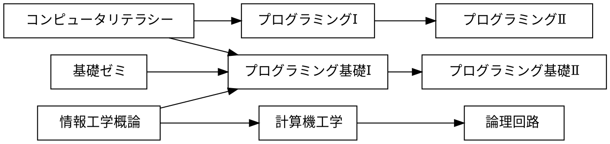

# 課題

## 課題 3.1 有向グラフ


プレビュー結果が上の図のようになるように，下記の記述を完成させよ．(接続関係が正しければ，上下が入れ替わっても構わない)

※ 日本語の文字列に対する箱の大きさが適切でない場合には，前後に空白を入れて調整せよ



## 課題 3.2 WBS


プレビュー結果が上の図のようになるように，下記の記述を完成させよ．(色や影などの違いは気にしなくてよい)

```plantUML
@startwbs ex02
* 拓殖大学
** 商学部
*** 経営学科
*** 国際ビジネス学科
*** 会計学科
** 政経学部
*** 法律政治学科
*** 経済学科
*** 社会安全学科
** 外国語学部
*** 英米語学科
*** 中国語学科
*** スペイン語学科
*** 国際日本語学科
** 工学部
*** 機械システム学科
*** 電システムがっか
*** 情報工学科
*** デザイン学科
** 国際学部
*** 国際学科
@endwbs
```

## 課題 3.3 ユースケース図


プレビュー結果が上の図のようになるように，下記の記述を完成させよ．ただし，別名については適当に設定してよい．(色や影などの違いは気にしなくてよい)

```plantUML
@startuml usecase01
left to right direction
actor "学生" as student
actor "教員" as faculty
rectangle 履修管理システム {
    usecase "課題の登録" as chkgrd
    usecase "課題の受領" as setgrd
    usecase "リポジトリのクローン" as chktbl
    usecase "課題ファイルの修正" as getlist
    usecase "修正をステージに上げる" as regist
    usecase "修正のコミット" as regisd
    usecase "リモートリポジトリにpush" as regge
    usecase "提出結果の採点" as regji
}
student --> setgrd
chkgrd <-- faculty
student --> chktbl
regji <-- faculty
student --> getlist
student --> regist
student --> regisd
student --> regge
@enduml
```

## 課題 3.4 オリジナルの図解

「有向グラフ」「WBS」「ユースケース図」のどれかを使って，
独自の図解を作成せよ．対象は自由に決めてよいが，
誰かのコピーにならないように留意せよ．

```plantUML
@startwbs ex02
* 田尾優人
** 田尾優一
*** 田尾八重子
** 田尾由紀
*** 西内美恵子
*** 西内克昭

@endwbs
```

## チェック
- [ ] 課題 3.1 有向グラフ
- [ ] 課題 3.2 WBS
- [ ] 課題 3.3 ユースケース図
- [ ] 課題 3.4 オリジナルの図解
